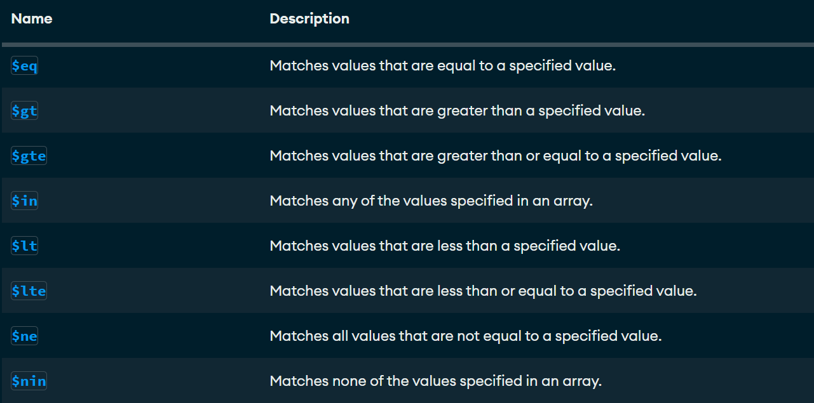
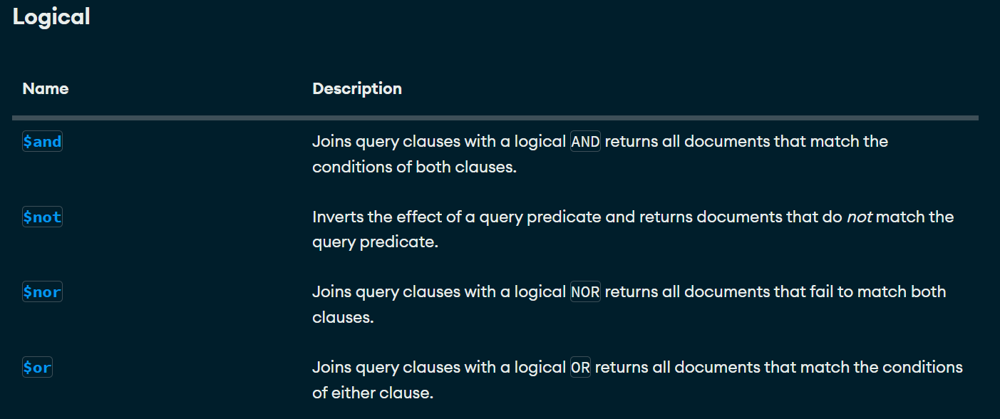

# CRUD y consultas en MongoDB

## Crear una base de datos
Solo se crea si contiene por lo menos una colección
use bd1

## Cómo crear una colección
use bd1
db.createCollection("Empleado")

## Mostrar las colecciones
show collections

## Insertar un documento
```json
db.coleccion.insertOne(
    {
        nombre: 'Estefany',
        apellido1: 'Vazquez',
        edad: 22,
        ciudad: 'Huehuetoca'
    }
)
```

## Inserción de un documento más complejo con array
```json
db.alumnos.insertOne(
 {
   nombre: "Martha",
   apellido: "Trinidad",
   apellido2: "Hernandez",
   edad: 19,
   aficiones: [
                 "Dibujo", "Videojuegos", "Musica"
              ]
 }
 )
 ```

 ## Inserción de documentos más complejos con documentos anidados
```json
db.alumnos.insertOne(
 {
    nombre: "Naomi",
    apellido: "Mondragon",
    apellido2: "Martinez",
    edad: 20,
    estudios: [
      "Licenciatura en Derecho",
      "Licenciatura en Psicología",
      "Licenciatura en Logística"
    ],
       esperiencia: {
        lenguaje: "SQL", sbd: "SQL Server", AniosExp: 2
        }
 }
 )

db.alumnos.insertOne(
 {
    nombre: "Sorge",
    apellido: "Huaso",
    apellido2: "Villegas",
    edad: 23,
    aficiones: [
      "Dinero",
      "Hombres",
      "Fiesta"
    ],
        talentos: { 
        embriagarse: true,
        bañarse: false
        }
}
)
```
# Practica1

## Cargar Datos
[libros.json](./data/libros.json)

[empleados.json](./data/empleados.json)

## Busquedas. Condiciones simples de igualdad. Metodo find()

1. Seleccionar todos los documentos de la coleccion libros
```json
db.libros.find({})
```

2. Mostrar todos los documentos que sean de la editorial biblio
```json
db.libros.find({editorial: "Biblio"})
```

3. Mostrar todos los documentos cuyo precio sea 25
```json
db.libros.find({precio: 25})
```

4. Seleccionar todos los documentos donde el titulo sea json para todos
```json
db.libros.find({titulo: "JSON para todos"})
```

## Operadores de comparacion

[operadores de comparacion](https://www.mongodb.com/docs/manual/reference/operator/query/)

```json
== $eq
< $gt
<= $gte
> $lt
>= $lte
!= $ne
$nin Matches none of the values specified in an array.
== en array $in
```



1. Mostrar todos los documentos donde el precio sea mayor a 25
```json
db.libros.find({precio: {$gt: 25}})
```

2. Mostrar los documentos cuyo precio sea 25

```json
db.libros.find({precio: {$eq: 25}})
```

3. Mostrar los documentos cuya cantidad sea menor a 5

```json
db.libros.find({cantidad: {$lt: 5}})
```

4. Mostrar los documentos que pertenezcan a la editorial biblio o planeta

```json
db.libros.find({editorial: {$in: ["Planeta","Biblio"] }}) 
```

5. Mostrar todos los documentos de libros que cuesten 20 o 25 

```json
 db.libros.find({precio: {$in: [20,25] }})
```

6. Mostrar todos los documentos de libros que no cuesten 20 o 25

```json
 db.libros.find({precio: {$nin: [20,25] }})
```

7. Mostrar el primer documento de libros que cueste 20 o 25

```json
db.libros.findOne({precio: {$in: [20,25] }})
```

## Operadores Logicos

[operadores logicos](https://www.mongodb.com/docs/manual/reference/operator/query/)



### Operador AND

Dos posibles opciones de AND

1. La simple, mediante condiciones separadas por comas. 

***Sintaxis***
```json
db.coleccion.find({condicion 1, condicion 2}) -> Con esto asume que es un ***$AND***
```
2. Usando el operador ***$AND***

***Sintaxis***
```json
db.coleccion.find($and: [{condicion1}, {condicion2}])
```

#### Ejercicios

1. Mostrar todos aquellos libros que cuesten mas de 25 y cuya cantidad sea inferior a 15

***Forma simple***
```json
db.libros.find({precio: {$gt: 25}, cantidad: {$lt: 15}})
```

***Forma compleja***
```json
db.libros.find({$and: [{precio: {$gt: 25}}, {cantidad: {$lt: 15}}]})
```

2. Mostrar todos aquellos libros que cuesten mas de 25 y cuya cantidad sea inferior a 15 e id igual a 4

***Forma simple***
```json
db.libros.find({precio: {$gt:25}, cantidad: {$lt:15}, _id: {$eq: 4}})
```

***Forma compleja***
```json
db.libros.find({$and: [{precio: {$gt: 25}}, {cantidad: {$lt: 15}}, {_id: {$eq: 4}}]})
```

### Operador OR

2. Usando el operador ***$OR***

#### Mostrar todos aquellos libros que cuesten mas de 25 o cuya cantidad sea inferior a 15

```json
db.libros.find({$or: [{precio: {$gt: 25} }, {cantidad: {$lt: 15} },] })
```

### AND y OR combinados

1. Mostrar los libros de la editorial Biblio con precio mayor a 40 o libros de la editorial Planeta con precio mayor a 30


Forma Compleja
```json
db.libros.find( 
  {
    $or:
      [
        {
          $and:
            [
              {
                precio:
                  {
                    $gt: 30
                  }
              },
              {
                editorial:
                  {
                    $eq: "Biblio"
                  }
              }
            ]
        },
        {
          $and: 
            [
              {
                precio:
                  {
                    $gt: 20
                  }
              },
              {
                editorial:
                  {
                    $eq: "Planeta"
                  }
              }
            ]
        }
      ]
  }
)
```

Forma simple

```json
db.libros.find(
  {
    $or:
      [
        {
          precio: {$gt: 30}, editorial: {$eq: 'Biblio'}
        },
        {
          precio: {$gt: 20}, editorial: {$eq: 'Planeta'}
        }
      ]
  }
)
```

## Proyeccion de Columnas (mostrar solo ciertos campos)

```json
  db.colection.find(filtro, columnas)
```

db.libros.find({},{titulo:1})

1. Seleccionar todos los documentos, mostrando el titulo y la editorial:

```json
db.libros.find({},{titulo:1, _id:0, editorial:1})
```

2. Seleccionar todos los documentos de la editorial planeta, mostrando solamente el titulo y la editorial

```json
db.libros.find({editorial: 'Planeta'},{titulo:1, _id:0, editorial:1})
```

## Operador exists (Permite saber si un campo se encuentra o no en un documento)

#### Mostrar todos los documentos que no contengan el campo cantidad

```json
db.libros.insertOne({_id:10, titulo:'Mongo en entornos graficos', editorial: 'terra', precio: 125})

db.libros.find({cantidad: {$exists: false}})
```

## Operador type (Permite preguntar si un determinado campo corresponde con un tipo)

[Operador Type](https://www.mongodb.com/docs/manual/reference/operator/query/type/#mongodb-query-op.-type)

1.Mostrar todos los documentos donde el precio sean de tipo double

```json
db.libros.insertOne({_id:11, titulo:"IA", editorial: "terra", precio: 125.4, cantidad: 20})
db.libros.find({precio: {$type: 1}})
[
  {
    _id: 11,
    titulo: 'IA',
    editorial: 'terra',
    precio: 125.4,
    cantidad: 20
  }
]
```

2. Seleccionar los documentos donde el editorial sea de tipo entero

```json
db.libros.find({editorial:{$type: 'int'}})
db.libros.find({editorial:{$type: 16}})
```

3. Seleccionar todos los documentos donde el editorial sea string

```json
db.libros.find({editorial:{$type: 'string'}})
db.libros.find({editorial:{$type: 2}})
```

## Practica de consultas

1. Instalar las tools de mongodb
[DatabaseTools](https://www.mongodb.com/try/download/database-tools)

2. Cargar el json empleados (debemos estar ubicados en la carpeta donde se encuentra el JSON empleados)

En local: 
comando: 
  mongoimport --db curso --collections 

# Modificando Documentos
## Comandos importantes

1. updateOne -> Este permite modificar un solo documento.
1. updateMany -> Este permite modificar multiples documentos.
1. replaceOne -> Sustituir el contenido completo de un documento.

Tiene el siguiente formato:

```json
db.collection.UpdateOne({filtro}, {operador: })
```

[Operadores Update](https://www.mongodb.com/docs/manual/reference/operator/update/)

### Operador set

1. Modificar un documento

```json
 db.libros.updateOne({titulo: 'Python para todos'}, {$set: {titulo: "Java para todos"}})
```

2. Actualizar el precio a 100 y la cantidad a 50 para el _id: 10

```json
 db.libros.updateOne({_id: 10}, {$set: {precio: 100, cantidad: 50}})
```

3. Modificar todos los documentos donde le precio sea mayor a 100 a un precio de 150

```json 
db.libros.updateMany({precio: {$gt: 100}}, {$set: {precio:150}})
```

### Operador $inc y $mul
1. Actualizar con un incremento de $5 todos los documentos 
json
db.libros.updateMany(
    {},
    {$inc:{precio:5}}
)


2. Actualizar con multiplicación de 2 todos los documentos que sean mayores a 20
json
db.libros.updateMany(
    {cantidad:{$gt:20}},
    {$mul:{cantidad:2}}
    )


3. Actualizar todos los documentos donde el precio sea mayor a $20 y se multimpliquen por 2 la cantidad y el precio 
json
db.libros.updateMany(
    {precio:{$gt:20}},
    {$mul:{cantidad:2, precio:2}}
)


### Reemplazar documentos (replaceOne)
json
db.libros.replaceOne(
    {_id:2},
    {
        titulo:'De la tierra a la luna',
        autor:'Julio Verne',
        precio:500}
)


### Borrar Documentos
1. deleteOne -> Elimina un solo documento
2. deleteMany -> Elimina multiples documentos


1. Eliminar el documento con id 2
json
```json
db.libros.deleteOne({_id:2})
```

2. Eliminar los documentos donde la cantidad sea mayor o igual a 150
json
```json
db.libros.deleteMany({cantidad:{$gte:150}})
```

### Expresiones regulares
1. Buscar los libros donde el titluo contengan la letra t
json
```json
db.libros.find({titulo:/t/})
```

2. Buscar los libros que en el tiltulo contengan la palabra 'Json'
json
```json
db.libros.find({titulo:/JSON/})
```
3. Todos los documentos que en el titulo terminen en tos
json
```json
db.libros.find({titulo:/tos$/})
```

4. Todos los documentos que en el titulo comiencen con J
json
```json
db.libros.find({titulo:/^J/})
```

### Operador $regex
[Operador Regex](https://www.mongodb.com/docs/manual/reference/operator/query/regex/)

1. Seleccionar los libros que contengan con la palabra 'para' en titulo
json
```json
db.libros.find({titulo:{$regex:'para'}})

db.libros.find({titulo: {$regex: 'JSON'}})

db.libros.find({titulo: {$regex: /JSON/}})
```
- Distinguir entre mayusculas y minusculas
```json
db.libros.find({titulo: {$regex: /json/}}) -> No distingue entre mayusculas y minuscula
db.libros.find({titulo: {$regex: /json/, $options: 'i'}}) -> Distingue entre mayusculas y minuscula
db.libros.find({titulo: {$regex: /json/i}}) -> Distingue y es mas corto

db.getCollection('libros).find({
  titulo: {
    $regex: RegExp('json'),
    $options: 'i'
  }
});
```
>- Seleccionar todos los libros que comiencen con j o J
```json
db.libros.find({titulo:{$regex:/^j/i}})
```
>- Seleccionar todos los libros que terminen es
```json
db.libros.find({titulo:{$regex:/es$/i}})
```
# Metodo sort (Ordenar Documentos)

1. Ordenar los libros de manera ascendente por el precio

```json
db.libros.find({}, {_id:0, titulo: 1, precio: 1}).sort({precio: 1})
```
2. Ordenar los libros de manera descendente por el precio

```json
db.libros.find({}, {_id:0, titulo: 1, precio: 1}).sort({precio: -1})
```

3. Ordenar los libros de manera ascendente por la editorial y de manera descendente por el precio, mostrando el titulo, el precio y la editorial

db.libros.find({}, {titulo: 1, precio: 1, editorial: 1, _id:0}).sort({editorial: 1, precio: -1})

# Otros Metodos skip, limit, size

db.libros.find({}, {titulo: 1, precio:1, _id: 0, editorial:1}).size()

db.libros.find({editorial: {$regex: /java/i}}).size()

-- Buscar todos los libros pero mostrando los dos primeros

db.libros.find({}, {titulo: 1, precio:1, editorial:1, _id:0}).limit(2)

-- Mostrar los 3 ultimos libros
db.libros.find({}, {titulo: 1, precio:1, editorial:1, _id:0}).limit(3).sort({precio: -1})

-- Seleccionar todos los libros ordenados por titulo de forma descendente saltando los 2 primeros documentos y que muestre el tamanio

db.libros.find({}).sort({titulo: -1}).skip(2).size()

# Borrar colecciones y base de datos

use db3
db.createCollection('a')
db.a.insertOne({nombre: 'Chapuin'})
db.a.drop()
db.dropDatabase()

